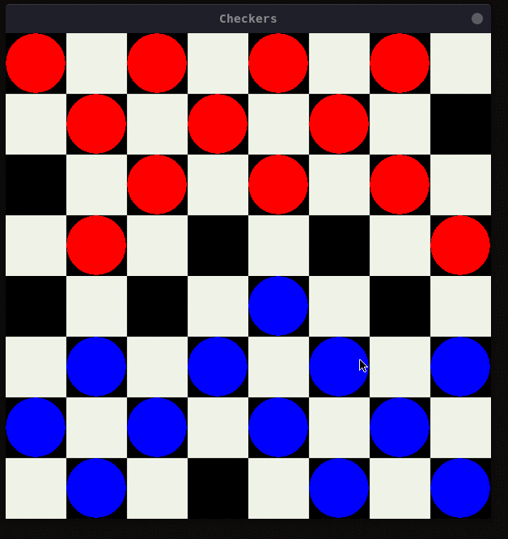
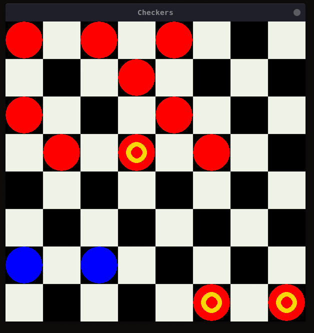
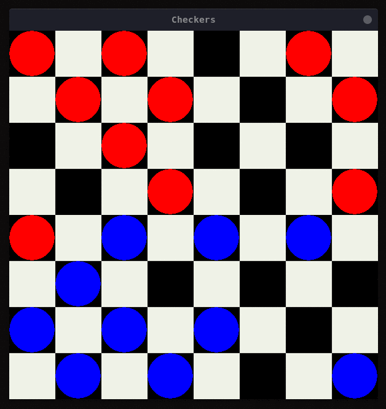
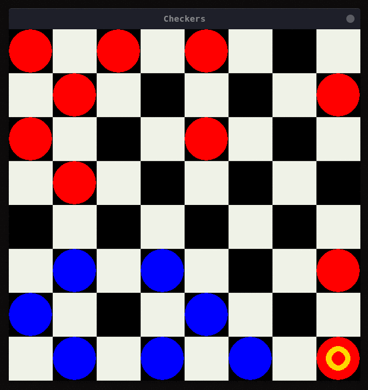

# Draughts-AI

## Introduction

The game of checkers is considered a complicated game with $10^{20}$ possible legal positions in the English draughts version ( $8\times8$ board) alone (much more on higher dimensions). In this attempt to create a game agent, a tree traversal approach has been used. This approach is not only fast but also efficient given that good heuristics are used. The agent has been created which is capable of playing the game of draughts or checkers with a remarkable win rate against average players. Draughts is a 1vs1 zero-sum game. Minimax or Minimax algorithm is best suited for such types of games. Following is the development procedure practised during the development of the project.

1. Implemented a basic Minimax Agent with limited depth.
2. Applied ⍺-β pruning.
3. Improved the evaluation functions.

<table>
    <tr>
        <td></td>
        <td></td>
    </tr>
    <tr>
        <td></td>
        <td></td>
    </tr>
</table>

## Evaluation Functions

Two types of evaluation functions have been used depending upon the state of the game. These are mid evaluation and end game evaluation function. Following is the report for the same.
List all the evaluation functions:

### Mid Evaluation

#### Piece to Value

$score = ∑P_i + 2 \times ∑K_i - ∑OP_i - 2 \times ∑OK_i$

Where $P_i$ and $OP_i$ are the player’s and opponent’s pawns and $K_i$ and $OK_i$ are the player’s and Opponent’s Kings respectively.

#### Piece and Board part to value

$score = 5 \times ∑PHP_i + 7 \times ∑EHP_i + 10 \times ∑K_i - (5 \times ∑PHOP_i + 7 \times ∑EHOP_i + 10 \times ∑OK_i)$

Where $PHP_i$ and $PHOP_i$ are the player’s and Opponent’s Pawns in their own respective halves and $EHP_i$ and $EHOP_i$ are their Pawns in their respective enemies halves.
$K_i$ and $OK_i$ are the player’s and Opponent’s Kings respectively.

#### Piece and Row to value

$score = ∑(5 \times P_i +r_i) + ∑(7 \times K_i + r_i ) - ((∑(5 \times OP_i + r_j) + ∑(7 \times OK_i + r_j))$

Where $P_i$ and $OP_i$ is the player’s and Opponent’s Pawns and $K_i$ and $OK_i$ are the player’s and Opponent’s Kings respectively. $r_j$, $r_i$ are the row number of the respective piece.

#### Piece and Board part to value (modified)

$score = \frac{5 \times ∑PHP_i + 7 \times ∑EHP_i + 10 \times ∑K_i - (5 \times ∑PHOP_i + 7 \times ∑EHOP_i + 10 \times ∑OK_i)}{n }$

Where $PHP_i$ and $PHOP_i$ is the player’s and Opponent’s Pawns in their own respective halves and $EHP_i$ and $EHOP_i$ are their Pawns in their respective enemies’ halves. $K_i$ and $OK_i$ are the player’s and Opponent’s Kings respectively. $n$ is the number of pieces on the board.

### End Evaluation

#### Sum of Distances

$D_{ij}$ = Distance of ith king of the player from jth King of the adversary.

$score = \sum_{i=0}^{i=n_1}\sum_{i=0}^{i=n_2}D_{ij}$

where $n_1$ is total number of kings of the player in the board and $n_2$ is total number of kings of the adversary in the board.

Minimise $score$ if player has more number of pieces than adversary else maximise.

#### Farthest Piece

$D_{ij}$ = Distance of ith King of player from jth King of the enemy.

$score = max(\sum_{j=1}^{n_2}{D_{ij}}) \space where \space i\in [1, n_1]$

where $n_1$ is total number of kings of the player in the board and $n_2$ is total number of kings of the adversary in the board.

Minimise $score$ if player has more number of pieces than adversary else maximise.

## How to run the code

First install Requirements

```
pip3 install -r requirements.txt
```

### Run the Game

```bash
python3 main.py
```

**You can tweak the parameters of the game bot from [main](main.py) file**

## Conclusion

1. Heuristics can be drastically improved by adding specific features.
2. The depth of the game tree has a significant influence on the quality of the computer player.
3. There's a tradeoff between calculation time and quality of the game.
4. It is not efficient to use Minimax without optimizations while with them it can be a good solution.
5. Alpha-Beta pruning is exponentially improving in comparison to Minimax as the depth grows.
6. Certain heuristics are clearly better than others but some of the “bad” ones still work well in some cases.

## References

1. Two player draughts game template has been taken from [Pygame-Checkers](https://github.com/everestwitman/Pygame-Checkers/)

## Contributing

Found a bug? Create an **[issue](https://github.com/Hsankesara/Draughts-AI/issues/new)**.
